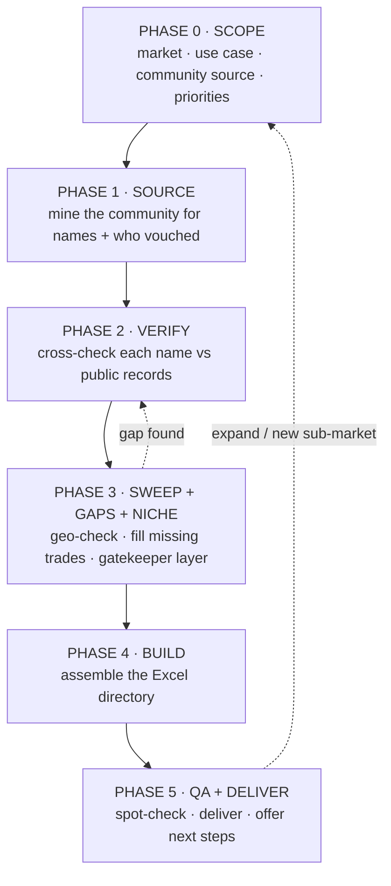

# Contractor / Sub Research Workflow: Team SOP

**Owner:** Ty Garrett, Volunteer Home Buyers (VHB)
**Purpose:** Build a vetted, market-serving directory of general contractors and subs (a full flip crew) for any market, so anyone on the team can staff a rehab with people who are real, licensed where it matters, actually serve the area, and come recommended by other investors, not just whoever ranks on Google.
**Skills:** [`vendor-directory-builder`](../skills/vendor-directory-builder/SKILL.md) (the research engine) and [`contractor-call-sheet`](../skills/contractor-call-sheet/SKILL.md) (the action layer). Both are in the catalog and on the agent map (Deal Analysis division).
**Last updated:** 2026-08-20. **Worked example inside:** Knox + Blount County, TN (68 providers).

> This SOP runs two ways: by hand (follow the phases below), or with the `vendor-directory-builder` skill, which drives the same process automatically. Either way the output is the same: one filterable Excel directory + top picks + a methodology tab. Section 5 covers running it with the skills; everything before that is the method itself.

---

## 0. When to run this

Run the workflow whenever you need reliable local people for construction/rehab work:

- **Entering a new market**: building a crew from zero (e.g., expanding into a new county).
- **Refreshing / deepening an existing crew**: you've outgrown one plumber, or a GC flaked.
- **Filling a gap**: you need a specialty trade you don't have (septic, termite, excavation, etc.).
- **Vetting a found list**: someone (a VA, ChatGPT, an old spreadsheet) handed you names and you don't trust them. Verifying a found list is one of the highest-value versions of this job.

**Scope note:** this SOP covers contractor/sub research only. Materials sourcing (supplier/Pro-account maps) is a separate track and is intentionally not part of this document.

---

## 1. The big idea: why the method works

Two weak signals combine into one strong one. Neither alone is enough, and understanding that is the whole game:

1. **Community recommendations are social proof from people who actually paid.** When an investor in a local Facebook group answers "who's a good plumber?" with a name, that's a referral backed by a real transaction, worlds better than an ad or a search result.
2. **Public records are independent verification.** Reviews (with counts), license boards, BBB, and the company's own website confirm the business exists, is licensed where required, is still operating, and actually serves the target area, none of which a forum post proves.

**The single strongest signal is cross-validation:** when two or more different people independently name the same provider, that's the best lead you can get. Those get called first.

**The one rule that makes the whole thing trustworthy: never fabricate.** People will dial these numbers and sign contracts off this sheet. Every field is either verified from a real source or marked "not found." A directory that's 80% filled and 100% honest beats one that's 100% filled and quietly wrong, every time.

---

## 2. The workflow at a glance



**Rule of thumb on effort:** "find me a couple good plumbers" is a light pass; "build my whole crew for this county and vet everyone" is the full six phases with parallel verification. When unsure on a sourcing/vetting task, lean thorough. A wrong number here costs a real person a wasted afternoon.

---

## 3. The workflow, phase by phase

### PHASE 0: Scope it (never skip)

Pin down the four things that actually change the work:

| Decide | Why it matters |
|---|---|
| **Market / geography** (primary + any secondary counties) | Becomes the "Serves [market]" column and the Phase-3 removal test. |
| **Use case** (flip crew? rental turnover? new build?) | Determines the **trade taxonomy** you must cover (see section 7). |
| **Community source** (which group/forum + can you reach it?) | A private FB group needs a logged-in browser. Confirm access or plan to lean on public sources. |
| **Vetting priorities** (experience / reliability / price / licensing) | So ranking reflects how the buyer actually thinks. |

If it's unattended or the buyer says "just go," make the reasonable call, state the assumption at the top of the deliverable, and proceed.

### PHASE 1: Source from the community

Mine the named community first. Its recommendations are the highest-signal input you'll get.

**Facebook group (the most common case):**
1. Use the group's **in-group search**, not the feed: `facebook.com/groups/<group>/search/?q=<term>`. Run it once per trade term (`contractor`, `general contractor`, `plumber`, `electrician`, `hvac`, `roofing`, `handyman`, `flooring`, `drywall`, `painter`, `foundation`, plus specialty/niche terms). Searching pulls years of relevant posts at once.
2. Harvest **two kinds of posts:**
   - **Self-promoters**: a provider advertising their own services; contact is right in the post text.
   - **Recommendation-request threads**: "who's a good ___?" The answers live in the **comments**. Open those threads (click the post to open it) and read the comments. That's where the peer referrals are.
3. **Capture per lead:** name/company, any contact info, trade, **who recommended them**, and sentiment. Flag anyone named by **2+ different people**.
4. If a trade is thin/absent in the group (specialty trades usually are), note it. You'll source those from public records in Phase 2. That's expected, not a failure.

**Other sources:** subreddits/forums (search + rec megathreads), Nextdoor (neighborhood recs), a referral list the buyer already has (jump straight to Phase 2). And the durable tactics for keeping a bench deep: **sub off an active flipper** ("who are your top 3, can I use your name?"), **ask supplier pro desks** who buys volume and pays on time, and **pull county permit records**. The contractors whose names recur on rehab permits are the busy, permit-pulling pros.

### PHASE 2: Verify against public records

This is the phase that makes the list trustworthy. If you're running it with the skill, this fans out across several research passes at once; by hand, work trade by trade. For **each** provider confirm:

- **Real business + best contact**: verify the phone/email from the company's own site; mark it *Verified* vs *from site* vs *unconfirmed*.
- **Service area covers the target market**: the most common silent failure. Check their service-area page + Google Business area.
- **Rating + review COUNT**: always the count, not just stars (a 5.0 on 3 reviews is not a 4.8 on 300). Name the source.
- **License / credential status**: look up the relevant board (see section 7). Record the number + active status where the work legally requires it, or "not found, verify" / "likely not required for small jobs." **Never assert a license you didn't see.**
- **BBB + red flags**: complaints, "closed" listings, out-of-state name collisions, lead-gen fronts, lapsed licenses.
- **Confidence**: a plain read. *High* = safe to call today; *Low* = a real lead but do a small test job first.

**Verifying a found / AI-generated list** (a common trigger): treat every field as a *claim*, not a fact. These lists routinely contain **wrong phone numbers**, **overstated scope** ("does water lines" when the site shows only concrete), and **businesses that don't exist in the market**. Catching those *is* the deliverable, and surface exactly what you corrected.

### PHASE 3: Sweep, gaps, and the niche layer

Three checks that turn a pile of names into a usable bench:

1. **Geography sweep.** Confirm each provider serves the whole target market. Cut the ones that don't (out-of-area / too far to realistically cover a secondary county). Mark metro-local providers whose secondary-area coverage isn't published as **"Confirm [area]"** rather than dropping them: likely fine, just verify on the call. Don't silently keep an out-of-area provider because the reviews are good.
2. **Gap analysis.** Compare what you have against the full trade taxonomy for the use case (section 7). Name the missing trades and fill them from public sources. Cover the whole job.
3. **The niche / gatekeeper layer.** Most use cases have a hidden layer the obvious list misses: the specialty vendors *and* the non-vendor bodies that gate the work (licensing boards, permit offices, and for a new water line, the **utility district** that owns the main and sets the tap fee). Put reference data like this in its own tab. This is often the most valuable part of the whole deliverable.

### PHASE 4: Build the directory

Assemble everything into one JSON config and run the builder. Don't hand-format a spreadsheet:

```bash
python skills/vendor-directory-builder/scripts/build_directory.py <config.json> <output.xlsx>
```

(The builder ships inside the `vendor-directory-builder` skill; its `assets/config_schema.md` documents every field.) It produces the **Directory** tab (filterable, color-coded, one row per provider), a **Top Picks by Category** tab, a **Methodology** tab, and any **reference tabs** you defined, with consistent formatting and computed summary counts.

### PHASE 5: QA and deliver

Spot-check a few phone numbers and any license claims, run the QA checklist (section 6), then deliver. Offer the natural next steps: expand a thin trade, geography-check against a new sub-market, or turn the top picks into a call sheet (that's the `contractor-call-sheet` skill).

---

## 4. Worked example: Knox + Blount County, TN

This is the actual build the workflow produced, so a team member can see a finished example and know what "good" looks like.

- **Source:** the private *Knoxville Real Estate Investors* Facebook group (~5.8K members), mined via in-group search across every trade.
- **Sourcing yield:** self-promoters gave direct contacts (e.g., **Patriotic Plumbing**, CMC-licensed, BBB A+, 4.8 stars on 43 reviews); recommendation threads gave peer-vouched names. **Cross-validated** hits (named by 2+ people) included **KZ Electric**, **Hometown Electrical**, and **Fox Renovations**; those got prioritized.
- **Verification caught real problems:** several "Knoxville" businesses were actually 45-70 min out or out of state; **Banner Contracting** was mislabeled a GC when it's a roofer; unverifiable individuals were marked "not found," not invented.
- **Geography sweep** removed **5** providers who didn't serve both counties (Hometown Electrical = Monroe-area only; Jeff Woods & Action H/C/P = Crossville, Knox-only; Painters Tennessee = Nashville; Legacy Modular = Louisville, KY).
- **Gap analysis** added the specialty trades a general group is thin on: **septic** (critical for rural Blount), **termite/WDO**, **countertops**, **cabinets**, **dumpster/junk**, **landscaping/tree**, plus a confirmed-Blount electrician (**Volt Pro**, **Power'd Up**) to close a depth gap.
- **Niche layer** added an **Excavation / Underground-Utility** section for new water lines *and* a **Water Utility Districts** reference tab (who owns the main, tap fees by meter size, the "long-side tap = you pay the road bore" gotcha, and which districts make the contractor do the connection). This is the piece most lists never include.
- **Found-list correction:** a co-founder's ChatGPT list of excavators had **two wrong phone numbers** (Elliott & Son, Hurst) and one company (Heath/Heathcrete) that **doesn't do water lines at all**. All corrected in the sheet, with the ChatGPT-suggested "HD Excavating" flagged **UNVERIFIED** because no Knox/Blount business by that name could be confirmed.
- **Final deliverable:** 68 providers across ~20 trade categories, 20 starred top picks, a "Serves Knox + Blount" flag on every row (35 confirmed, the rest flagged to confirm), and Top Picks, Methodology, and Water Utility Districts tabs.

The lesson for the team: the value wasn't the raw list. It was the **verification, the geography sweep, the gap-fill, and the niche layer**. Anyone can paste names; this workflow is what makes them trustworthy.

The finished workbook and call sheet live in the Contractor-Research-Toolkit folder on the Desktop (`Knoxville_Flip_Contractor_Directory.xlsx`, `Knox-Blount-Crew-Call-Sheet.html`). The distributable skill bundles carry a fictionalized example instead; the real provider data stays internal.

---

## 5. Running it with the skills

Both skills are in the SiftStack catalog (`python install.py --only vendor-directory-builder,contractor-call-sheet`) and install to `~/.claude/skills`.

### `vendor-directory-builder`: the research engine (Phases 0-5)
Triggers on things like *"build me a contractor/sub list for [county],"* *"find a reliable flip crew in [market],"* *"vet these contractors,"* or *"expand/geo-check my directory."* It asks the Phase-0 scoping questions, mines the community, verifies against public records, runs the sweep + gap analysis + niche layer, and builds the Excel via its bundled `build_directory.py`. Also the right tool when you hand it a found list to verify.

**Inside the skill** (for anyone who wants to go deeper): `references/sourcing-playbook.md` (community mining), `references/vetting-checklist.md` (verification + license boards + catching AI lists), `references/use-case-taxonomies.md` (trade taxonomies), and `assets/config_schema.md` (the builder input).

### `contractor-call-sheet`: the action layer (what you do with the list)
Takes the finished directory (or just the top picks) and produces a **one-page call sheet**, **personalized first-contact messages** per provider, and the **vetting-call question script**, so the list turns into calls the same day. Triggers on *"make a call sheet from this directory,"* *"draft outreach to these contractors,"* *"who do I call first."*

**Typical end-to-end:** run `vendor-directory-builder` to produce the directory, run `contractor-call-sheet` on it, then start dialing the cross-validated top picks.

---

## 6. QA checklist: before you trust or hand off a directory

- [ ] Every phone/email is **verified from a real source** or explicitly marked **"not found."** No guesses.
- [ ] **Geography sweep done:** every row is "Serves [market]" = Yes, or flagged "Confirm [area]." No silent out-of-area rows.
- [ ] **License/credential claims checked** on the relevant board (numbers recorded where the trade requires it).
- [ ] **Ratings include counts** and name the source.
- [ ] **Gap analysis run** against the trade taxonomy: every trade the use case needs has at least one option, or is noted as an open gap.
- [ ] **Cross-validated names (2+ recommendations) are flagged** as call-first.
- [ ] **Found-list corrections surfaced**: anything you fixed or couldn't verify is called out, not buried.
- [ ] **Niche/gatekeeper layer** included where the job has one (permits, utility districts, specialty licensing).
- [ ] Top picks starred; Methodology tab explains how it was built.

---

## 7. Reference library

### Trade taxonomy: full flip / rehab crew
**Core (about 90% of a flip):** GC / whole-house · Handyman · Plumbing · Electrical · HVAC · Roofing · Foundation/waterproofing · Flooring · Painting · Drywall · Finish carpentry / cabinets · Decks.
**Specialty (thin in a general group, source publicly):** Septic (inspect/pump/repair) · Termite/WDO · Countertops (stone fab + install) · Cabinets (stock/RTA source) · Dumpster/junk/cleanout · Landscaping/tree.
**Niche / gatekeeper layer:** Excavation / underground utility / new water line · the water **utility district** (owns the main, sets tap fees) · the permit/codes office.
**Usually skip (a GC/roofer absorbs them):** garage doors, gutters, siding, windows, insulation.
*(Rental-turnover and new-build have their own taxonomies; see the skill's `use-case-taxonomies.md`.)*

### License / credential boards (US, by domain)
- **Construction trades:** the state contractor licensing board. Search "[state] contractor license lookup." Note the dollar threshold above which a state license is required (often ~$25k) and that the classification must cover the work (building / mechanical-plumbing / electrical).
- **Plumbing / HVAC / electrical:** often a separate trade license or a classification under the contractor board; small jobs may run under a limited/municipal license.
- **Specialty regulated work:** septic installers (state environmental/health dept), pest/termite WDO inspectors (state agriculture dept charter; the entity issuing a "termite letter" must hold one), well drilling, asbestos/lead.
- **General businesses:** state Secretary of State entity search + BBB + the company site.

### The vetting-call questions (give these to whoever makes first contact)
- "Do you service [secondary area] as well as [primary area]?" (for the "Confirm" rows)
- "Do you work with investors/flippers, and can you give volume/repeat pricing?"
- "What's a realistic timeline, and will you hold that bid in writing?"
- "Do you pull permits, and is that in the price?"
- "Can you send a certificate of insurance (COI) and your license number?"
- "Payment terms: draws on completion, or money up front?" (heavy up-front deposits are a red flag)

### Common pitfalls
- **Fabricating a field** to look complete: the cardinal sin. Mark "not found."
- **Trusting a found list** at face value: verify every number and claim.
- **Skipping the geography sweep**: great reviews on a company that won't drive to your county is a dead lead.
- **Stars without counts**: a 5.0 on 2 reviews is noise.
- **Over-chasing a group for specialty trades** that live in public records instead.

---

## 8. Quick start (TL;DR)

1. **Scope:** market, use case, which community to mine, what to prioritize.
2. **Mine** the community's in-group search per trade; grab self-promoters + open the recommendation threads; flag anyone named twice.
3. **Verify** every name against reviews (with counts), the right license board, and service area. Mark unknowns "not found." Never invent.
4. **Sweep** for geography, **fill** the missing trades, **add** the niche/gatekeeper layer.
5. **Build** the Excel with the builder script; **QA** with the checklist; **deliver** and offer the call sheet.

Fastest path: hand the whole thing to the **`vendor-directory-builder`** skill and answer its scoping questions.
