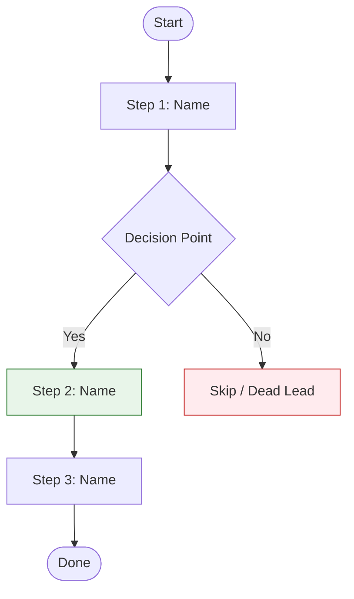

# SOP Template

Use this template when creating Standard Operating Procedures. Change sections as needed for the process. Write at a **5th-grade reading level** using short sentences and simple words. Use **Mermaid flowcharts** for process maps and decision trees. Use **UI screenshots** for software interfaces, specified Scribe-style (capture + highlight + crop), never custom graphics.

**Every SOP is a pair.** The human document below is for the team. If the steps are things an AI agent could do or help with, also produce the agent-executable twin: a `.sop.md` file in the format from [agent-sop-format.md](agent-sop-format.md), validated with `scripts/validate_sop.py`. Same process, two readers. The human doc explains and shows; the twin parameterizes and constrains.

---

## Template Structure

```markdown
# [Process Name]

**SOP** · [N] steps · Created [Month D, YYYY] · Owner: [role]

---

## Purpose & Overview

[One paragraph: what this process does and why it matters. Be specific about the result.]

**Purpose:** [One sentence: what are we trying to do?]

**How:** [One sentence: how are we going to do it?]

**Done when:** [The observable end state. What exists when this worked?]

---

## Process Map

Here's the full workflow at a glance:



[One sentence: "Here's how each step works in detail."]

---

## What You Need

### Tools & Access

| Tool | What It's For | How to Get It |
|------|---------------|---------------|
| [Tool 1] | [Purpose] | [Link or steps] |
| [Tool 2] | [Purpose] | [Link or steps] |

### Inputs

[What you start with, and where it comes from. These become the Parameters
of the agent twin, so name them the same way.]

| Input | Where It Comes From | Example |
|-------|--------------------|---------|
| [county] | [Assigned by manager] | Knox |
| [source_csv] | [Output of the daily pull] | output/knox_daily.csv |

### Setup

1. **[Setting 1]**: [Steps]
2. **[Setting 2]**: [Steps]

> **SCREENSHOT: [Setup Screen]**
>
> *Capture: [The settings screen, in the state the reader will see]*
> *Highlight: [The one control to find]*
> *Crop: [How tight to zoom, keeping enough context to orient]*

---

## Steps

### Step 1: [Step Name]

**Goal:** [What this step does in one sentence]

[Say what to do and why. Include details: what to click, type, or pick.]

**Actions:**

1. [Action-verb sentence naming the exact UI label: "Click the **Upload File** button in the sidebar"]
2. [Next action]
3. [Next action]

**Rules:**
- Always [the thing that must happen every time]
- Never [the thing that breaks it], because [reason]

> **SCREENSHOT: [Step 1 Screen]**
>
> *Capture: [The screen at this moment]*
> *Highlight: [The button or field just used]*
> *Crop: [Zoom guidance]*

> **Pro Tip:** [Practical insight from experience - something a trainer would mention]

---

### Step 2: [Step Name]

**Goal:** [What this step does]

**Actions:**

1. [Action with details]
2. [Action with details]

**Decision Gate:**
- IF [condition A] → Go to Step 3
- IF [condition B] → Skip to Step 4
- IF [condition C] → Go back to Step 1 and [change]

[For complex decisions with 3+ branches, add a visual decision tree:]

```mermaid
flowchart TB
    A{[Decision Question]} -->|Condition A| B[Action A]
    A -->|Condition B| C[Action B]
    A -->|Condition C| D[Action C]

    style B fill:#e8f5e9,stroke:#2e7d32
    style C fill:#fff3e0,stroke:#ef6c00
    style D fill:#ffebee,stroke:#c62828
```

**Check:** [How to know this step worked before moving on]

**Record it:** [Where the result of this step gets written - the tracker,
the CRM note, the file. Every step that produces something names where it lands.]

---

### Step 3: [Step Name]

[Continue the pattern: Goal, Actions, Rules where needed, Check, Record it.]

---

## Worked Example: [Scenario Name]

[Walk through ONE complete real scenario applying every step above.]

**Starting point:** [What you begin with - e.g., "A new foreclosure notice from Knox County"]

**Step 1 applied:** [What you do and what you see]
**Decision:** [What you decided and why]
**Step 2 applied:** [What you do next]
[...continue through all relevant steps...]

**End result:** [What the finished product looks like]

---

## Decision Guide

### [Decision Point Name]

| Criteria | Threshold | What to Do |
|----------|-----------|------------|
| [Criteria 1] | [Value or condition] | [Action] |
| [Criteria 2] | [Value or condition] | [Action] |

### Formula

```
[Result] = ([Input A] ÷ [Input B]) × [Multiplier]
```

**Example:** [Worked example with real numbers]

---

## Quality Check

### Checklist

1. [ ] [First check]
2. [ ] [Second check]
3. [ ] [Third check]

### Common Problems

| Problem | Cause | Fix |
|---------|-------|-----|
| [Problem 1] | [Why it happens] | [How to fix] |
| [Problem 2] | [Why it happens] | [How to fix] |

---

## Troubleshooting

### [Problem Type 1]

**Problem:** [What goes wrong]

**Fix:**
1. [First step]
2. [Second step]

### [Problem Type 2]

**Problem:** [What goes wrong]

**Fix:** [Steps to fix]

**Stuck?** [Who to ask, and what to have ready when you ask.]

---

## Quick Reference

### Steps at a Glance

| Step | What to Do | What You Should See |
|------|------------|---------------------|
| 1 | [Brief action] | [Result] |
| 2 | [Brief action] | [Result] |
| 3 | [Brief action] | [Result] |

### Key Numbers

| Metric | Minimum | Target | Maximum |
|--------|---------|--------|---------|
| [Metric 1] | [Value] | [Value] | [Value] |
```

---

## The Agent Twin

When the process is agent-runnable, translate the finished human SOP into the `.sop.md` format. The mapping is mechanical:

| Human SOP section | Agent twin section |
|-------------------|--------------------|
| Title | `# Title` (same name) |
| Purpose & Overview | `## Overview` (2-4 self-contained sentences) |
| Inputs table | `## Parameters` (snake_case names, required first, defaults stated) |
| Steps (Goal + Actions) | `### N. Step Name` + plain description |
| Rules, Checks, Decision Gates | `**Constraints:**` lines (You MUST / SHOULD / MAY; every MUST NOT carries a because) |
| Record it | Constraint naming the exact artifact path |
| Worked Example | `## Examples` |
| Common Problems + Troubleshooting | `## Troubleshooting` |

What does NOT carry over: screenshots, Mermaid charts, pro tips, reading-level prose. The twin is lean; the human doc carries the teaching.

Save it next to the human doc as `[process-name].sop.md` and run:

```bash
python <skill-path>/scripts/validate_sop.py [process-name].sop.md
```

Fix every error before delivering. See [agent-sop-format.md](agent-sop-format.md) for the full format spec.

---

## Section Guidelines

### Purpose & Overview
- Keep to 2-3 sentences plus the three labeled lines
- "Done when" is mandatory: an SOP without an observable end state cannot be checked

### Process Map
- Mermaid flowchart showing all steps and decision points
- Place right after the overview, before the detailed steps
- Color coding: green = keep/success, red = skip/dead, orange = review/caution
- Max 7 nodes per chart; split into overview + detail charts past that

### What You Need
- Tools with how to get them, inputs with where they come from
- The Inputs table is the bridge to the agent twin's Parameters: use the same names

### Steps
- Each step: Goal, numbered Actions, Check, and Record it when the step produces anything
- Actions are action-verb sentences naming the exact UI label in bold ("Click the **Finish Upload** button"), one action per line
- Rules capture the must/never lines, with the reason on every never
- Decision gates where paths split; Mermaid decision tree at 3+ branches
- Screenshot spec (capture + highlight + crop) for screens and buttons, placed after the action it shows
- Pro Tip callouts for experienced insights

### Worked Example
- ONE complete scenario through every step, decisions included
- Often the most valuable section for new team members
- When working from a transcript, the trainer's own walkthrough IS the worked example

### Decision Guide
- Tables for threshold-based decisions, formulas with worked numbers
- Make criteria measurable

### Quality Check + Troubleshooting
- A checklist someone actually runs, common problems with causes and fixes
- End with who to ask when stuck

### Quick Reference
- The whole SOP in one scannable table, plus key numbers
